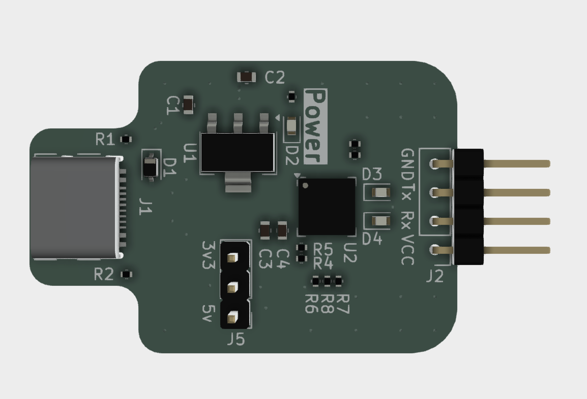

<picture>
  <source media="(prefers-color-scheme: dark)" srcset="http://svg.wiersma.co.za/github/project.v2?title=bytebridge&tag=usb%20to%20uart&mode=dark">
  <source media="(prefers-color-scheme: light)" srcset="http://svg.wiersma.co.za/github/project.v2?title=bytebridge&tag=usb%20to%20uart">
  
</picture>

`ByteBridge` a USB to UART breakout board with more power.

Features:

* CP2102 bridge
* AMS1117 capable of delivering 1A

## Why

In 2025, dealing with Micro/Mini-USB is a pain. Additionally, most flash boards do not deliver
enough current to power a stock ESP32, making to process more difficult than it needs to be.

## Changelog

#### v0.1.0

* Initial schematic and board
